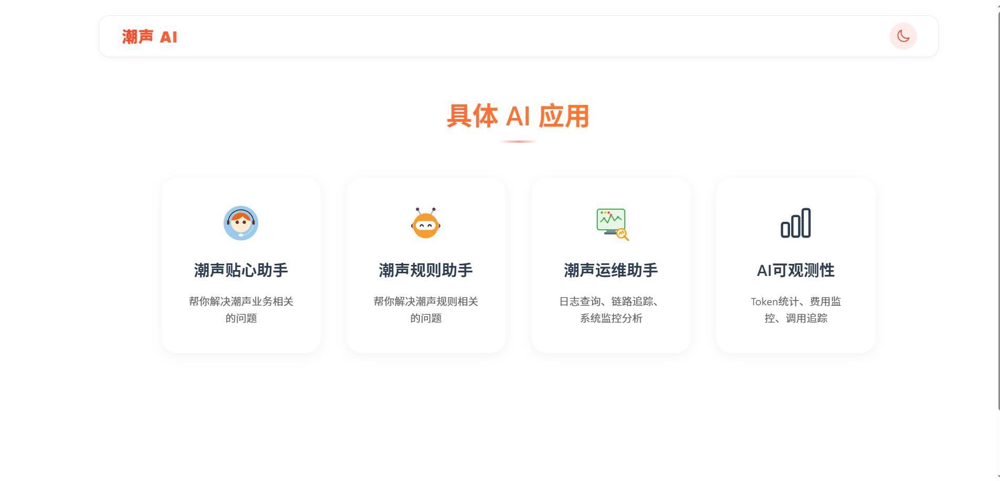
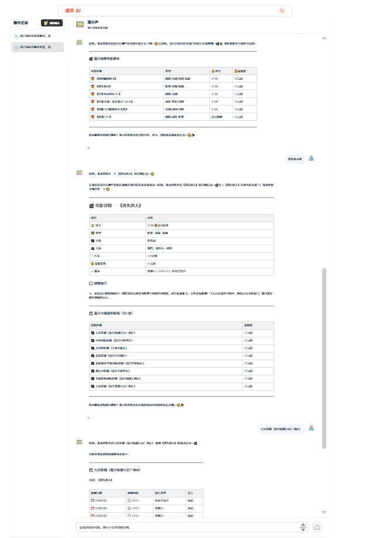
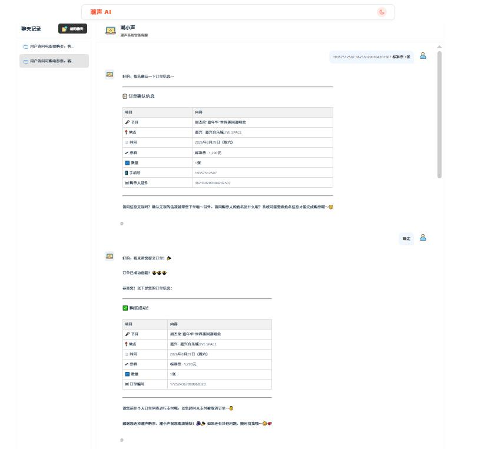
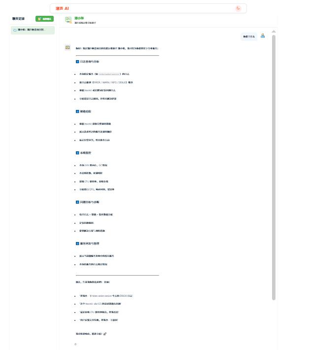
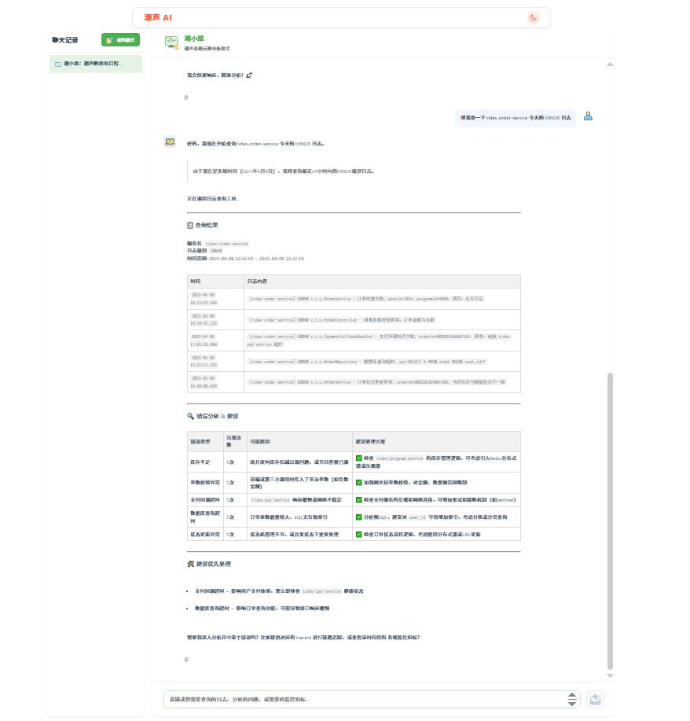
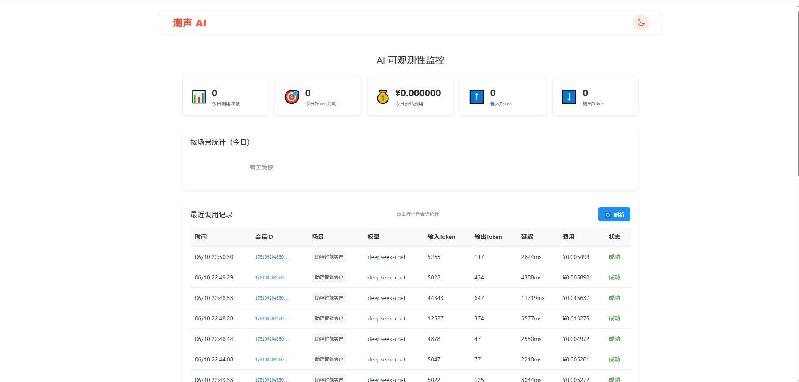

# Tides AI

Tides AI is a Java and Vue based project for AI-assisted ticketing and related service workflows.

## Modules

- `tides-core-service`
- `tides-mcp-server`
- `vue`
- `sql/tides_ai.sql`

## Stack

- Java 17
- Spring Boot
- Vue 3
- Vite

## Screenshots

