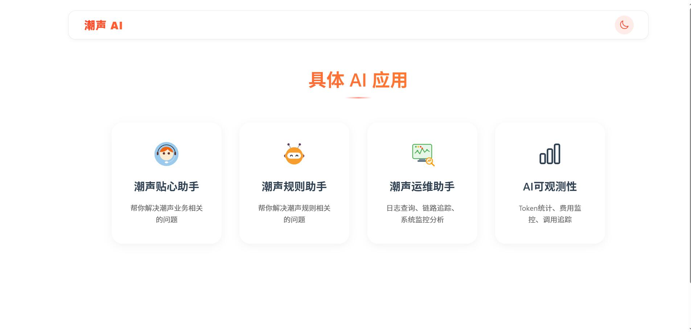
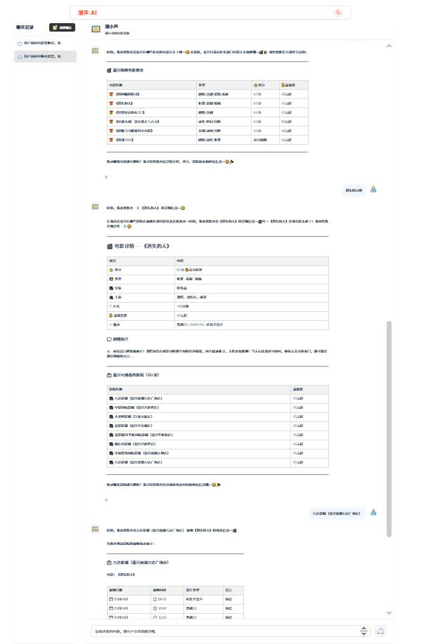
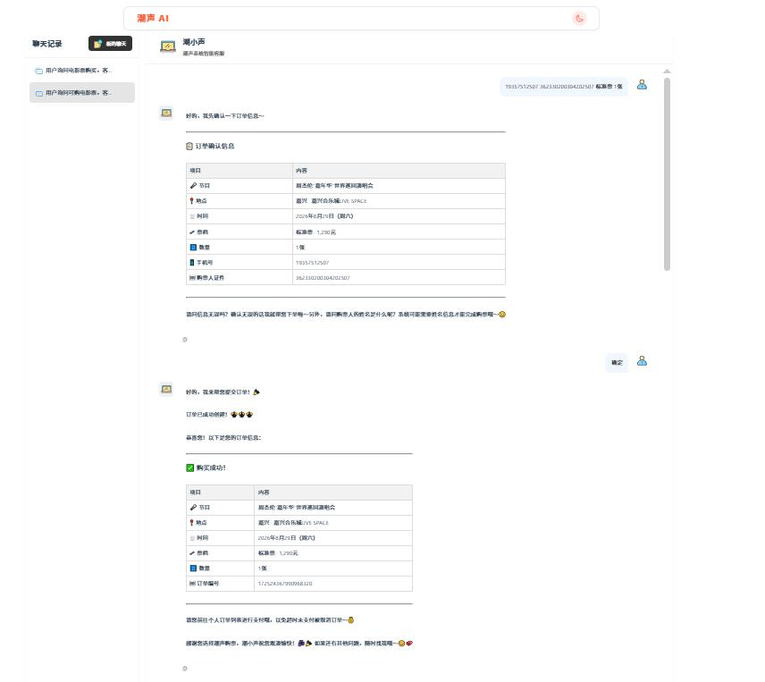
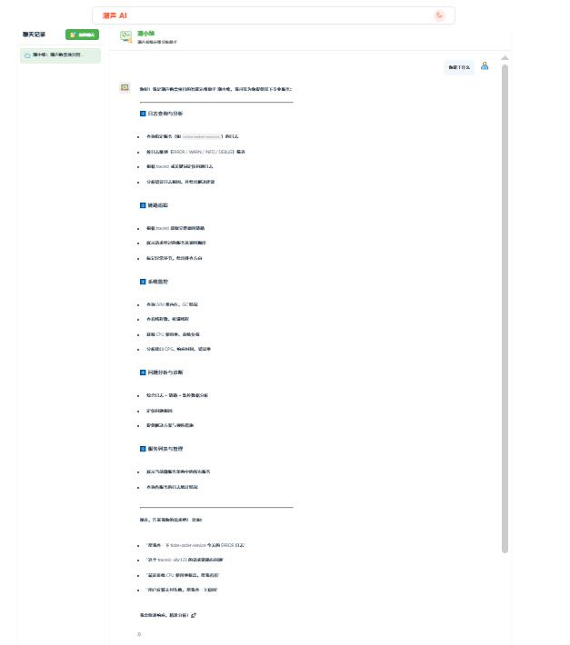
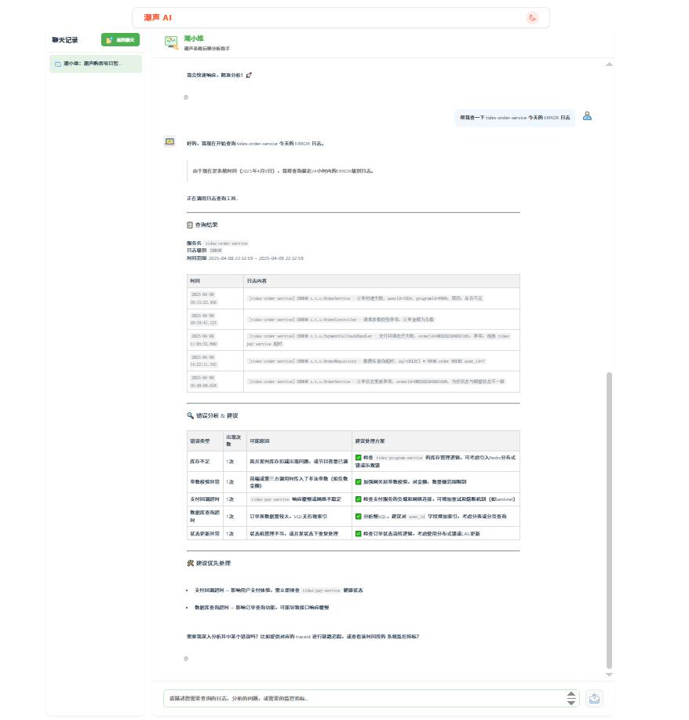
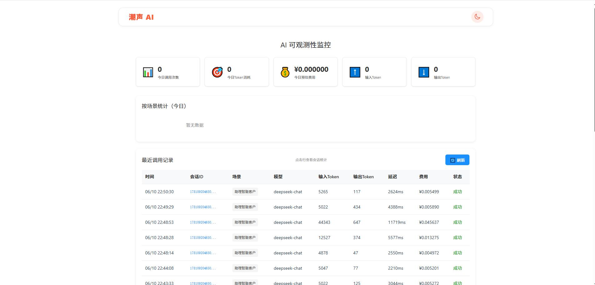
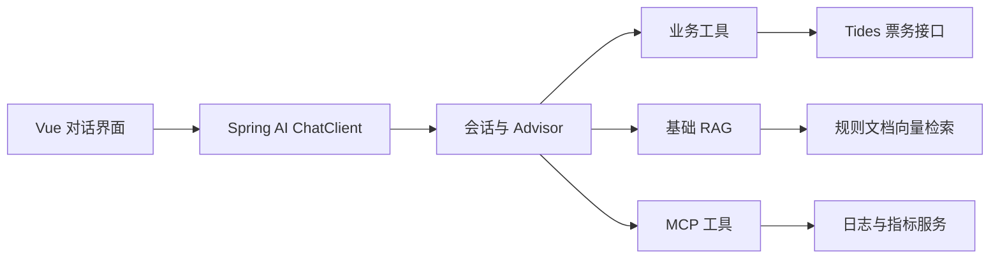

# 潮声 AI 助手 Tides AI

基于 Spring AI 的票务业务助手，将节目与电影查询、购票规则问答和运维信息检索接入对话界面。

**Java 17 · Spring Boot · Spring AI · Tool Calling · RAG · MCP · Vue 3**

[功能与边界](#功能与边界) · [代码导航](#代码导航) · [运行准备](#运行准备) · [票务业务系统](https://github.com/19continue/tides)

## 项目预览

<table>
  <tr>
    <td></td>
    <td></td>
  </tr>
</table>

<details>
<summary>展开更多界面截图</summary>






</details>

## 功能与边界

| 场景 | 实现方式 | 说明 |
| --- | --- | --- |
| 业务咨询 | ChatClient + Tool Calling | 将节目、电影、票档、场次等查询映射为业务接口调用 |
| 规则问答 | Markdown 文档 + VectorStore + QuestionAnswerAdvisor | 基础 RAG 路径，依据检索上下文生成回答 |
| 连续对话 | ChatMemory + Advisor | 会话上下文、历史记录与标题处理 |
| 运维查询 | MCP 工具接入 | 日志检索、traceId 相关查询及 JVM 等指标查询 |
| 交互输出 | SSE | 流式返回回复内容 |
| 调用观测 | Observability Advisor | Token 与调用耗时等记录入口 |

用户助手和运维助手使用不同的客户端配置与工具集合。Prompt 的角色划分仍需配合后端鉴权，不能代替数据访问权限控制。

## 调用关系


```mermaid
flowchart LR
    A[Vue 对话界面] --> B[Spring AI ChatClient]
    B --> C[会话与 Advisor]
    C --> D[业务工具]
    D --> E[Tides 票务接口]
    C --> F[基础 RAG]
    F --> G[规则文档向量检索]
    C --> H[MCP 工具]
    H --> I[日志与指标服务]
```

## 代码导航

| 关注点 | 入口 |
| --- | --- |
| 助手配置、会话记忆与工具绑定 | [TidesAiAutoConfiguration](tides-core-service/src/main/java/org/javaup/ai/config/TidesAiAutoConfiguration.java) |
| 业务工具与参数映射 | [AiProgram](tides-core-service/src/main/java/org/javaup/ai/ai/function/AiProgram.java) |
| 文档问答配置 | [TidesRagAiAutoConfiguration](tides-core-service/src/main/java/org/javaup/ai/config/TidesRagAiAutoConfiguration.java) |
| 文档加载 | [MarkdownLoader](tides-core-service/src/main/java/org/javaup/ai/ai/rag/MarkdownLoader.java) |
| 日志工具 | [LogQueryMcpTool](tides-mcp-server/tides-mcp-log-service/src/main/java/org/javaup/mcp/tool/LogQueryMcpTool.java) |
| 指标工具 | [MetricsQueryMcpTool](tides-mcp-server/tides-mcp-metrics-service/src/main/java/org/javaup/mcp/tool/MetricsQueryMcpTool.java) |
| 调用观测 | [AiObservabilityAdvisor](tides-core-service/src/main/java/org/javaup/ai/advisor/AiObservabilityAdvisor.java) |

仓库还包含 Query Rewrite、混合检索与重排序的实验代码。这些扩展需要结合实际接线和端到端评测验证，尚不以“准确率提升”作为已验证结论。默认向量存储使用 `SimpleVectorStore`，部署时需单独考虑数据持久化与容量。

## 仓库结构

```text
tides-core-service/          AI 对话、业务工具与文档问答
tides-mcp-server/            日志与指标 MCP 服务
vue/                        对话前端
sql/tides_ai.sql             数据库脚本
```

## 运行准备

根 [pom.xml](pom.xml) 声明 Java 17、Spring Boot 3.5.0、Spring AI 1.0.0。接口与配置应以仓库锁定的依赖版本为准。

1. 准备项目所需的数据库，并核对 [数据库脚本](sql/tides_ai.sql)。
2. 配置可用的对话模型、Embedding 模型及各自凭据；模型配置与向量维度需要匹配。
3. 接入票务工具前，准备 [Tides](https://github.com/19continue/tides) 对应服务；使用运维助手时准备日志、指标服务和 MCP 地址。
4. 核对各模块本地配置后，构建后端并启动对应 Spring Boot 应用；前端从 `vue` 目录启动。

后端构建入口：

```bash
mvn -DskipTests clean package
```

该命令跳过测试，不代表运行环境或模型调用已验证。

前端入口：

```bash
cd vue
npm install
npm run dev
```

## 验证建议

- 用固定问题分别检查工具选择、参数完整性与业务返回值。
- 规则问答同时覆盖文档内问题、文档外问题和多轮追问，记录检索结果及引用依据。
- 统计首段响应时间、完整响应时间与 Token 消耗；先建立评测基线，再比较检索策略。
- 涉及用户或订单的操作，由业务服务校验身份、权限和幂等性。
